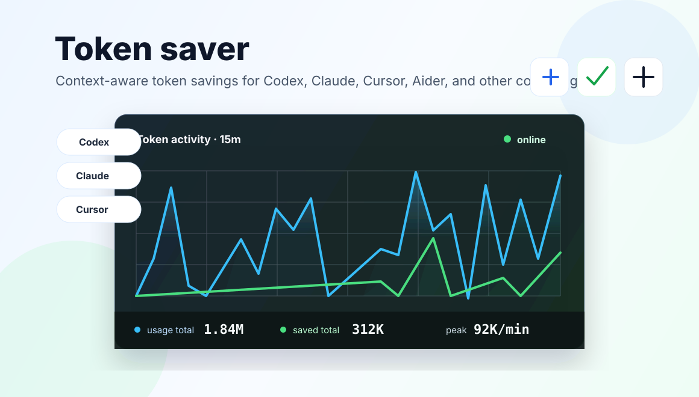

# Token saver

[](LICENSE)
[](#quick-install)
[](#quick-install)
[](#what-gets-installed)

**A lightweight Windows token saver for Codex, Claude Code, Cursor, Aider, and AI coding agents.**

Token saver helps reduce AI coding token usage by generating compact project context, attaching itself to coding-agent workflows, and showing a small live monitor for local usage and savings estimates.



## Why It Exists

AI coding sessions often spend a lot of context on repeated repository scans, noisy command output, and files that are not relevant to the current task. Token saver gives agents a short, high-signal context package first, then lets them open specific source files only when needed.

The goal is simple: keep the agent useful, reduce repeated token waste, and make the numbers visible.

## Who It Helps

- Developers using **Codex**, **Claude Code**, **Cursor**, or **Aider** on Windows.
- People working in large repositories where agents repeatedly rescan the same files.
- Anyone looking for lightweight **token optimization**, **context engineering**, or **AI coding agent cost reduction** without a heavy proxy setup.

## Highlights

- **Agent-specific installers** for Codex, Claude Code, Cursor, Aider, and generic tools.
- **Auto attach for old and new projects** so users do not need to remember setup steps every time.
- **Compact `.codex/context.md` generation** with README, config, entry points, tests, changed files, and recent files prioritized.
- **Floating Token saver panel** with a 15-minute usage chart, saved-token chart, online status, and reset controls.
- **Local-first metrics** from observable request logs, context estimates, and manual/log-based usage records.
- **Safe uninstall** that removes Token saver marker blocks without deleting user-owned project files.

## Quick Install

Install for Codex:

```powershell
powershell -ExecutionPolicy Bypass -File .\install-codex.ps1
```

Install for a specific agent:

```powershell
powershell -ExecutionPolicy Bypass -File .\install-claude.ps1
powershell -ExecutionPolicy Bypass -File .\install-cursor.ps1
powershell -ExecutionPolicy Bypass -File .\install-aider.ps1
powershell -ExecutionPolicy Bypass -File .\install-generic.ps1
```

Install for every detected agent:

```powershell
powershell -ExecutionPolicy Bypass -File .\install-all-agents.ps1
```

`install-all-agents.ps1` only writes adapters for agents detected on the machine. Missing adapters are listed in `skippedAgents`. To prewrite every adapter anyway:

```powershell
powershell -ExecutionPolicy Bypass -File .\install-all-agents.ps1 -ForceAll
```

Install only the commands, without scanning existing projects:

```powershell
powershell -ExecutionPolicy Bypass -File .\install.ps1 -NoAutoAttach
```

## What Gets Installed

| Agent | Installer | Rule file |
| --- | --- | --- |
| Codex | `install-codex.ps1` | `%USERPROFILE%\.codex\AGENTS.md` |
| Claude Code | `install-claude.ps1` | `CLAUDE.md` |
| Cursor | `install-cursor.ps1` | `.cursor/rules/token-saver.mdc` |
| Aider | `install-aider.ps1` | `.aider.token-saver.md` |
| Other tools | `install-generic.ps1` | `TOKEN_SAVER.md` |

Each adapter writes a removable `Token Saver Auto Attach` marker block. The marker tells the agent to run Token saver before broad codebase exploration, then read `.codex/context.md` first.

## Use It Manually

Generate a compact context package:

```powershell
powershell -ExecutionPolicy Bypass -File .\codex-token-kit.ps1 -ProjectPath "C:\path\to\your\project"
```

Open the floating panel:

```powershell
token-helper panel -ProjectPath "C:\path\to\your\project"
```

After install, users can reopen the panel from either:

- the **Token saver** desktop shortcut
- the Windows Start Menu entry named **Token saver**
- the command above

Closing the panel with `X` only closes the monitor window. It does not disable Token saver. To disable the helper, open settings and turn off `Helper enabled`.

Refresh or inspect metrics:

```powershell
token-helper refresh -ProjectPath .
token-helper status -ProjectPath .
token-helper refresh -ProjectPath . -AllProjects
token-helper config -HelperEnabled true -ThresholdTokens 8000 -ContextBudgetChars 12000
token-helper health
token-helper paths
token-helper doctor
token-helper reset
```

## Generic Usage Tracking

Token saver can also track tools that are not Codex when you provide a context file, log file, or manual token counts.

```powershell
# Estimate tokens from a context file.
token-helper refresh -ProjectPath . -ContextPath ".\context.md"

# Parse common token fields from logs.
token-helper refresh -ProjectPath . -LogPath ".\logs"

# Record a manual observation.
token-helper refresh -ProjectPath . -ManualUsageTokens 12000 -ManualSavedTokens 3000
```

Common parsed fields include `total_tokens`, `input_tokens`, `output_tokens`, `prompt_tokens`, `completion_tokens`, `saved_tokens`, and `helper_saved_tokens`.

## What The Panel Shows

The Token saver panel shows one compact activity view:

- **Blue line**: recent token usage.
- **Green line**: recent Token saver savings.
- **Usage total**: observed usage in the current reset window.
- **Saved total**: observed savings in the current reset window.
- **Online dot**: green when the helper is enabled, red when it is disabled.

The panel is intentionally small. Pin it near the edge of the screen, keep working, and use it like a token task manager.

## Uninstall

```powershell
powershell -ExecutionPolicy Bypass -File .\uninstall.ps1
```

Remove local cumulative data too:

```powershell
powershell -ExecutionPolicy Bypass -File .\uninstall.ps1 -RemoveData
```

Uninstall removes Token saver marker blocks and auto-created helper files. It preserves files that existed before install.

## Important Limits

Token saver is an estimate and workflow helper, not a billing system.

- It does not claim exact ChatGPT, Codex App, or OpenAI billing totals.
- Local Python workers or background apps do not consume Codex conversation tokens unless they call an AI API or are analyzed in an agent conversation.
- Savings are only counted as actual savings when a project has run the helper and generated observable records.
- Lower context budgets save more tokens, but complex tasks can need more context. The settings panel shows performance risk so users can adjust safely.

## Documentation

The detailed engineering guide was moved to:

```text
docs/GUIDE.md
```

It covers token accounting, adapter behavior, context generation, regression tests, and the long-term optimization roadmap.

## Development Checks

Run the full release gate:

```powershell
powershell -ExecutionPolicy Bypass -File .\test-token-saver-release.ps1 -CloseExistingPanel
```

Run the MVP smoke test:

```powershell
powershell -ExecutionPolicy Bypass -File .\test-token-helper-mvp.ps1
```

After changing scripts, sync global shims and run health checks:

```powershell
.\codex-sync-global-bin.ps1
powershell -ExecutionPolicy Bypass -File .\test-token-helper-panel-smoke.ps1
```

## Design Principle

Token saver does not try to make complex tasks use zero tokens. It removes low-value noise and gives coding agents the right context first: project structure, constraints, entry points, configs, tests, and current changes.

## License

MIT. See [LICENSE](LICENSE).
